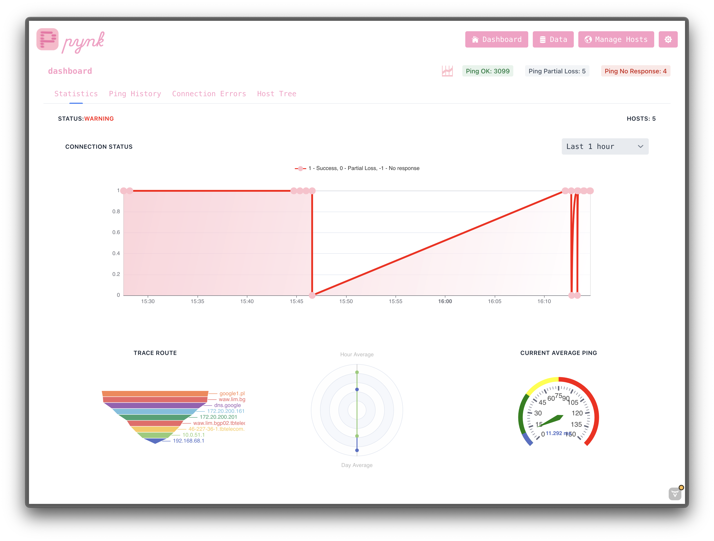
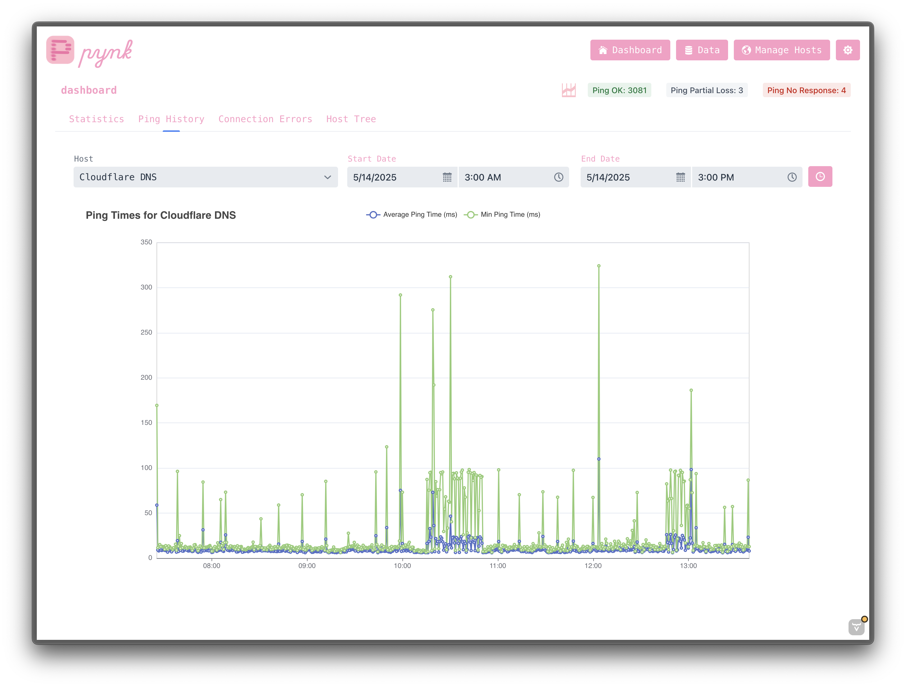
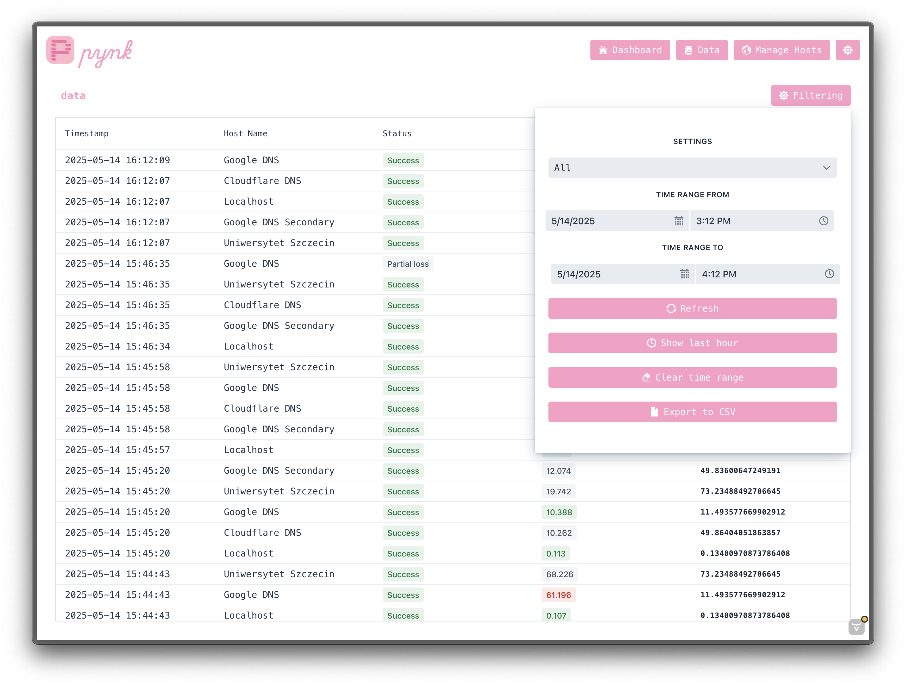

# Pynk


System for generating and analyzing network statistics.



## Description

Pynk is a powerful tool designed to help you analyze and visualize network statistics. It provides insights into network performance, traffic patterns, and other relevant metrics.

## Project Structure

```
pynk/
├── README.md
└── pynk - service for analyzing and analitics generation
└── pynk_web - web application for data monitoring
└── readme_resources - visual resources for readme file
└── pynk_database_schema - database schema for pynk application
```

## Features

- Multi-database support (SQLite and MongoDB)
- Automated host monitoring
- Concurrent job management
- Real-time host status tracking
- Automatic database reconnection (MongoDB)



---
## Architecture

### Database Support
The application supports two database types:
1. **SQLite**
   - Used for local storage
   - Configured through `databasePath` in properties file
2. **MongoDB**
   - Used for distributed storage
   - Configured through `databaseUrl` in properties file

### Core Components

#### 1. Host Management
- Hosts are the primary entities being monitored
- Each host has:
  - Unique identifier (ID)
  - Name
  - Status (active/inactive)
  - Job execution time interval

#### 2. Thread Management System
The application implements three main thread management systems:

##### a. Host Refresh Thread
- Periodically refreshes host data from the database
- Default refresh interval: 30 seconds
- Maintains an active hosts list in a thread-safe `ConcurrentHashMap`
- Updates host statuses and removes inactive hosts

##### b. Job Manager Thread (SQLite)
- Manages individual job threads for each active host
- Creates new job threads for newly active hosts
- Removes threads for inactive hosts
- Checks host status every 5 seconds

##### c. MongoDB Host Manager Thread
- Specific implementation for MongoDB database
- Manages host monitoring in MongoDB environment
- Includes automatic database reconnection every 6 hours
- Maintains separate job threads for each active host

### Job System
- Each host has its own dedicated job thread
- Jobs run at intervals specified by `hostJobTime`
- Two types of jobs:
  1. `Job` class for SQLite implementation
  2. `DocumentJob` class for MongoDB implementation
---



## The engine

The `PingEngine` class is a Java implementation for handling network ping operations with MongoDB integration. It provides functionality to ping hosts, perform traceroute operations, and DNS lookups (dig), while storing the results and logs in a MongoDB database.

## Core Functionality

### Main Components
- Ping execution and analysis
- Traceroute operations
- DNS lookup (dig) operations
- MongoDB logging integration
- Packet data collection and analysis

### Primary Methods

#### 1. `pingHost(Host host)`
- **Purpose**: Public interface to ping a specified host
- **Input**: `Host` object containing host information
- **Output**: `PingData` object with comprehensive ping results
- **Process**: Calls internal ping method with 8 packets by default

#### 2. `pingHostInternal(String host, int count)`
- **Purpose**: Core ping implementation
- **Process Flow**:
  1. Creates a new `PingData` object
  2. Executes system ping command
  3. Parses ping output for:
     - Individual packet hop times
     - Packet transmission statistics
     - Round-trip time metrics (min/max/avg)
  4. If ping fails:
     - Automatically runs dig lookup
     - Performs traceroute
  5. Classifies the ping result
  6. Stores raw ping data

### Supporting Operations

#### Traceroute (`traceHost`)
- Executes with following parameters:
  - Maximum 10 hops (`-m 10`)
  - Single query per hop (`-q 1`)
  - 2-second timeout (`-w 2`)
- Returns complete traceroute output as string

#### DNS Lookup (`digHost`)
- Performs DNS lookup using dig command
- Returns complete dig output including exit code

## Data Collection

### PingData Metrics
The system collects:
- Packet hop times
- Packets transmitted/received
- Round-trip time statistics
  - Minimum
  - Maximum
  - Average
- Raw ping output
- Additional diagnostics (if ping fails):
  - Traceroute data
  - DNS lookup results

### Logging
The system maintains detailed logs in MongoDB for:
- Job execution
- Ping success/failure
- Error conditions
- Diagnostic operations

## Error Handling
- Robust error handling for:
  - Ping execution
  - Output parsing
  - Network failures
  - Command execution issues
- All errors are logged to MongoDB with:
  - Error messages
  - Color coding (#FF0000 for errors)
  - Operation context

## Integration
- Integrates with `DocumentDatabaseEngine` for MongoDB operations
- Works with `Host` and `PingData` entities
- Part of larger `Pynk` system
---
## Configuration
## Initial configuration
1. Your machnine should have an `traceroute` tool, you can install it by using `sudo apt install traceroute -y`
2. Only supported host operating systems are Linux and MacOS.
3. Java 17 or higher.
4. Docker and Docker Compose tooling if you are building from docker-compose.
5. MongoDB connection from container or standalone.
### Properties File
- Location: `./pynk.properties`
- Key configurations:
  - `databaseType`: "sqlite" or "mongodb"
  - `databasePath`: Path for SQLite database
  - `databaseUrl`: URL for MongoDB connection
---
## Installation
###  With docker-compose
TBA
### From Release
1. Make sure You have a MongoDB instance with connection-string:
    - make sure that docker is added to sudo: `sudo groupadd docker` and `sudo usermod -aG docker $USER` - then restart host machine.
    - to install mongodb use docker image: `docker pull mongodb/mongodb-community-server:latest` and run the database with `docker run -d \
      --name mongodb \
      -e MONGODB_INITDB_ROOT_USERNAME=admin \
      -e MONGODB_INITDB_ROOT_PASSWORD=password \
      -p 27017:27017 \
      mongo`
    - or use official docker-compose file and run `docker-compose up -d` in the root folder
2. Copy the newest release.
3. Run the `pynk_service.jar` with command `java -jar pynk_service.jar` - it create default .properties file.
4. Run the `pynk_service` in the background - make sure the PingEngine started - check logs.
5. Run the `pynk_web.jar` with command `java -jar pynk_web.jar --server.port=<selected_port>` - make sure the port is free and allowed on the firewall.
6. Open browser on `http://<your_ip>:<selected_port>`.
---
## Contributing

Contributions are welcome! Please feel free to submit a Pull Request.

## License

This project is licensed under the MIT License.


## Contact
kubawawak@gmail.com - Jakub Wawak
